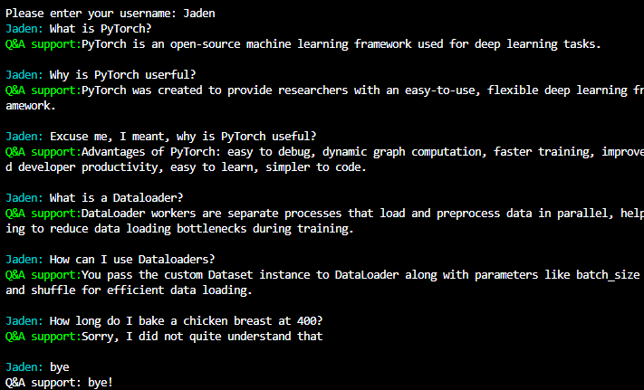

## Q&A ChatBot using multiple online sources on PyTorch

### Objective

The purpose of this document is to properly compare methods within NLP such as word vectorization and sentence similarity. The task at hand to do this comparison will be seeing how well it can perform answering user questions. The questions and answers will be on PyTorch but this can easily be altered to your liking. The idea comes from Chapter 4 in *Hands-On Python Natural Language Processing By Kedia and Rasu* that uses cosine similarity and tf-idf for their own chat bot.  

### Example Output

### Definitions

**Word Vectorizations:** Represents data in a mathematical form. Most common approach is representing them as a vector. 
$sentence = \langle w_1,w_2,w_3,...w_n \rangle$ 
- Tf-Idf: Term Frequency Inverse Document Frequency.  
    - Tf: Takes account in how frequent a term occurs in a document
    - Idf: Measures importance of the word in a document. If it is more rare, then it will become higher
    
    - $TF(w) =\frac{\text{Number of times word w appears in a document}}{\text{Total Number of words in document}}$
    - $IDF(w) = log(\frac{\text{Total Number of documents}}{\text{Number of documents containing word w}}\text{)}$

To make more sense, re-think of this as sentence, not document.

- BERT:  Bidirection encoder representations from transformers. Langauge model that can represent text as a sequence of vectors. It is an encoder only architecture. This is a pre-trained model

**Sentence Similarity:** Using the vector spaces, assesses how close each vector (sentence) is to each other.  
- Cosine Similarity
    - $cos(\theta)= \frac{A \cdot B}{||A||||B||}$
     <i>or</i>
    - $cos(\theta)= \frac{A \cdot B}{\sqrt{\sum_{i=1}^{i=N} i = w^2_{iA}}\sqrt{\sum_{i=1}^{i=N} i = w^2_{iB}}}$
    
- Euclidean Similarity
    - $d(p,q)^2 = (q_1 - p_1)^2 + (q_2 - p_2)^2 + ... + (q_i - p_i)^2$
     <i>Simplify by getting square root</i>
    - $d(p,q) = \sqrt{(q_1 - p_1)^2 + (q_2 - p_2)^2 + ... + (q_i - p_i)^2}$

### Data
The data used for this is several Q&A websites on PyTorch. There were stored in the Data folder as .csv files. To make your own chat bot with a new topic, the primary task will be creating your new csv file(s) with 'QuestionBody' column and 'AnswerBody' column. 

Preprocessing for this data saw us lower casing all words, and lemmatizing each word. Goal is to make any close to identical words the same for proper vectorization and comparison that'll come afterwords. 
- Lower: *Hello -> hello, HELLO -> hello, JADEN -> jaden, Jaden -> jaden*
- Lemmatize: *studies -> study, studying -> study, studied -> study* 

Links to sources used 
https://www.kaggle.com/discussions/questions-and-answers/172221 
https://github.com/Devinterview-io/pytorch-interview-questions?tab=readme-ov-file 
https://www.javatpoint.com/pytorch-interview-questions 
https://www.synergisticit.com/pytorch-interview-questions-and-answers/ 
https://www.devopsschool.com/blog/top-50-interview-questions-and-answers-of-pytorch/ 

### Ranking
After feeding each version 10 questions with predetermined optimal answers. A ranking was given based on the total points earned from correct and partially correct answers. 

#1 Cosine Similarity and Bert 
#2 Cosine Similarity and Tf-Idf 
#3 Euclidean and Bert 